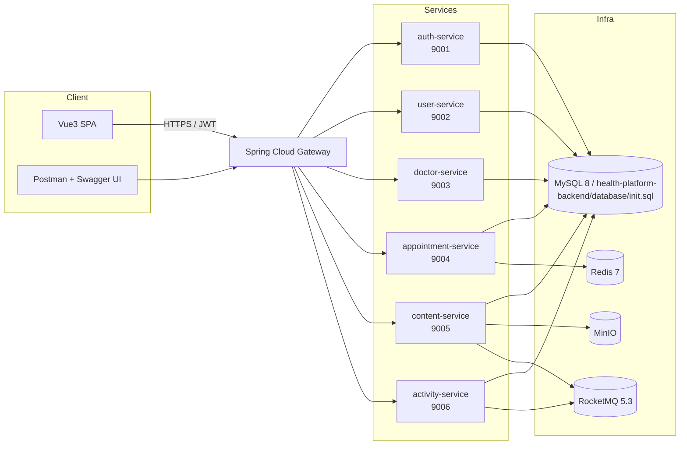

# 社区健康管理平台 (Community Health Platform)

> 基于 Spring Cloud Gateway + Spring Boot 3 + Vue3 的社区卫生服务平台，覆盖居民档案、医生排班、预约、资讯、活动与文件存储，并内建 JWT 安全、审计日志、RocketMQ 事件与 MinIO 对象存储。

## HR / 面试官可验证清单
| 资产 | 路径 | 作用 |
| --- | --- | --- |
| 项目白皮书 | [README.md](README.md) | 一键启动指引、架构图、功能点、Demo/文档/调试说明 |
| 一键启动脚本 | [docker-compose.yml](docker-compose.yml) · [start.cmd](start.cmd) | `docker compose up -d` 即可拉起 MySQL 依赖、Eureka、网关与全部微服务 |
| 数据初始化 | [health-platform-backend/database/init.sql](health-platform-backend/database/init.sql) | 一次导入全部表与种子数据：`mysql -uroot -p < health-platform-backend/database/init.sql` |
| API 规范 | [docs/api/openapi.yaml](docs/api/openapi.yaml) · [docs/swagger/index.html](docs/swagger/index.html) | Springdoc 自动 UI + 独立 Swagger UI（可直接推到 GitHub Pages）|
| 调试集合 | [postman_collection.json](postman_collection.json) | 含登录、档案、医生、预约、资讯、活动、文件接口，并内置 token/appointmentId 变量脚本 |

## 项目简介
- 前端：Vue 3 + Vite + Pinia + Element Plus + ECharts，提供居民端 & 管理端界面。
- 后端：Spring Cloud (Gateway + Eureka) + 多业务服务 (auth/user/doctor/appointment/content/activity)；`common` 模块沉淀统一异常、加解密、JWT、ApiResponse。
- 基础设施：MySQL + Redis + RocketMQ + MinIO。Redis+Lua 用于秒杀级预约抢号，RocketMQ 投递预约/活动事件，MinIO 统一管理文件与富文本附件。

## 功能亮点
- ✅ **统一认证**：Gateway + Spring Security + JWT，全链路在网关解密后回注 `X-User-Id / X-User-Role` 头，后端专注业务授权。
- ✅ **Springdoc/OpenAPI**：所有微服务集成 `springdoc-openapi-starter`，开箱即得 `/swagger-ui.html` 与 `/v3/api-docs`。
- ✅ **预约限流**：Redis Lua 脚本 + 幂等 key，防止重复下单；Redis 与 MySQL/Flyway 双写保证一致性。
- ✅ **内容与活动工作流**：文章支持草稿-审核-发布全流程，活动含容量校验、报名审计、RocketMQ 通知。
- ✅ **文件安全**：MinIO 上传校验 MIME/大小，返回直连 + 临时签名 URL，方便前端预览。
- ✅ **运维友好**：`docker-compose` 一次拉起、`health-platform-backend/database/init.sql` 一次导入、Postman 集合&OpenAPI 可随时校验接口行为。

## 体系架构


## 快速开始 (一键启动)
### 1. 准备依赖
- Docker 24+ / Docker Desktop（Windows 可直接双击 `start.cmd`）。
- 可选：JDK 21 + Maven 3.9（用于本机开发或单独运行某个服务）。
- MySQL 8（若本机未安装，可执行 `docker run --name health-mysql -e MYSQL_ROOT_PASSWORD=123456 -p 3306:3306 -d mysql:8`）。

### 2. 初始化数据库
```bash
# 导入全部表结构 + 种子数据 (管理员、居民、医生、文章、活动、排班等)
mysql -uroot -p < health-platform-backend/database/init.sql
```

### 3. 一键启动全部服务
```bash
# 拉起 Redis / RocketMQ / MinIO / Eureka / Gateway / 各业务微服务
docker compose up -d
# 查看网关日志（可 Ctrl+C 退出，不影响后台运行）
docker compose logs -f gateway
```
> Windows 用户可直接双击 `start.cmd`，或在 PowerShell 中执行 `./start.cmd`。

### 4. 验证 & 常用账号
| 功能 | 入口 | 说明 |
| --- | --- | --- |
| Eureka 控制台 | <http://localhost:8761> | 查看服务注册情况 |
| 网关健康检查 | <http://localhost:8080/actuator/health> | 由 Gateway 暴露 |
| Auth Swagger | <http://localhost:9001/swagger-ui.html> | 其余服务端口依次递增 (9002~9006) |
| Demo 账号 | `admin / admin123` | 登录后可通过 Postman 集合直接调用 |

## API 文档与调试
- **Springdoc UI**：各服务 `http://localhost:{port}/swagger-ui.html` ，`/v3/api-docs`/`/v3/api-docs.yaml` 可被工具抓取。
- **整合规范**：`docs/api/openapi.yaml` 汇总常用网关路径，`docs/swagger/index.html` 使用 CDN 版 Swagger UI 加载同一份 spec —— 打开 `docs/swagger/index.html` 即可预览。
- **GitHub Pages 托管方式**：
  1. Settings → Pages → Source 选择 `main` 分支 + `/ (root)`，保存后生成 `<user>.github.io/health-platform`；
  2. 访问 `https://<user>.github.io/health-platform/docs/swagger/` 即为公开 Swagger UI；
  3. 若需固定域名，可在 Pages 添加自定义域并配合 Cloudflare/HTTPS。
- **Postman 集合**：导入 `postman_collection.json` → 运行 `Auth / Login`，集合脚本会自动写入 `authToken`、`appointmentId` → 可立即调用其余接口。
  - 分享公共 Workspace：`...` → `Share collection` → `Move to workspace` → 选择/创建 *Public Workspace* → 打开页面复制分享 URL（注意在 `Environment` 中移除密钥）。

## Demo / 托管建议
### 1) Koyeb Git-driven Service
1. Fork 本仓库 → Koyeb 新建 App → 选择 GitHub 仓库。
2. Service A：`health-platform-backend/eureka-server/Dockerfile`，Region 任选，暴露端口 8761。
3. Service B：`health-platform-backend/gateway-service/Dockerfile`，暴露端口 8080；在 *Environment* 中配置：
   - `SPRING_DATASOURCE_URL`、`SPRING_DATASOURCE_USERNAME`、`SPRING_DATASOURCE_PASSWORD`（可指向 Aiven/Neon/Planetscale 等云 MySQL）；
   - `SPRING_DATA_REDIS_HOST`（可用 Koyeb Add-on Redis）;
   - `SECURITY_JWT_SECRET`（Base64 32 bytes）；
   - `EUREKA_URL=https://<koyeb-eureka-url>/eureka/`；
   - `CRYPTO_KEY`（Base64 256-bit，用于 AES-GCM）。
4. 服务启动后即可公开 `https://<koyeb-app>.koyeb.app/swagger-ui.html`、`/doctor/search` 等只读接口。

### 2) Render Web Service
1. 全局创建 Render Blueprint（或手动新建两个 Web Service）。
2. **Eureka**：
   - Build Command：`./mvnw -pl eureka-server -am package`
   - Start Command：`java -jar eureka-server/target/eureka-server-1.0.0.jar`
3. **Gateway**：
   - Build Command：`./mvnw -pl gateway-service -am package`
   - Start Command：`java -jar gateway-service/target/gateway-service-1.0.0.jar`
   - Environment：同上 (MySQL/Redis/JWT/CRYPTO_KEY)。
4. 如需演示预约接口，可额外部署 `appointment-service`（同理设置 Redis + RocketMQ，或将 `ROCKETMQ_NAME_SERVER` 指向 `rocketmq-namesrv` 容器）。
5. Render 提供免费 HTTPS 域名，可在 README 或简历中直接填入 Health Check (`/actuator/health`) 与 Swagger (`/swagger-ui.html`) 链接。

> Demo 仅需开放 GET 接口（医生列表、活动列表、Swagger）即可，避免暴露管理口与密钥。

## 环境变量速查
| 变量 | 示例值 | 说明 |
| --- | --- | --- |
| `SPRING_DATASOURCE_URL` | `jdbc:mysql://localhost:3306/healthdb?useSSL=false&serverTimezone=Asia/Shanghai` | 所有服务共享的 MySQL 连接串 |
| `SPRING_DATASOURCE_USERNAME/PASSWORD` | `root / 123456` | MySQL 账号 |
| `SPRING_DATA_REDIS_HOST` | `localhost` | 预约服务 Redis 主机 |
| `ROCKETMQ_NAME_SERVER` | `rocketmq-namesrv:9876` | 内容/活动/预约事件总线 |
| `MINIO_ENDPOINT / MINIO_ACCESS_KEY / MINIO_SECRET_KEY` | `http://minio:9000 / minioadmin / minioadmin` | 内容服务上传配置 |
| `SECURITY_JWT_SECRET` | `Base64Encoded256BitKey==` | Gateway/Auth 共用 JWT 秘钥 |
| `CRYPTO_KEY` | `Base64Encoded256BitKey==` | AES-GCM 加密居民敏感信息 |
| `EUREKA_URL` | `http://eureka:8761/eureka/` | 网关 & 各业务服务注册中心地址 |

## 目录结构
```
.
├── docker-compose.yml            # 一键拉起 Gateway + 所有微服务 + Redis/RocketMQ/MinIO
├── postman_collection.json       # Postman 公共集合 (含脚本变量)
├── docs/
│   ├── api/openapi.yaml          # 汇总常用 API 的 OpenAPI 3 规范
│   ├── release-test-checklist.md # 回归测试检查表
│   └── swagger/index.html        # 静态 Swagger UI (可直接托管到 Pages)
├── health-platform-backend/
│   ├── database/init.sql         # MySQL 初始化脚本 (schema + data)
│   └── ...                       # Spring Cloud 多模块后端
├── health-platform-frontend/     # Vue3 前端
├── start.cmd                     # Windows 一键调起 docker compose
└── ...
```

## 下一步规划
1. **CI/CD**：接入 GitHub Actions（build + docker push + Pages 自动化）。
2. **可观测性**：加入 Prometheus/Grafana 或 SkyWalking，补充链路追踪。
3. **Demo 自动化**：使用 Render Blueprint / Koyeb Stack 将 `docker-compose` 拆分为多服务，一键部署公共演示环境。
4. **前端预览**：利用 Vite SSR 或 Netlify Preview，自动绑定后端 Demo 域名，实现真机联调。
